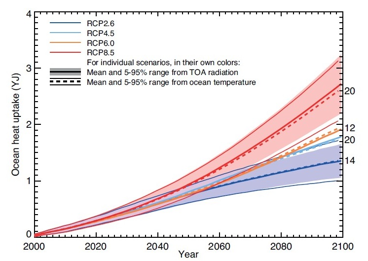
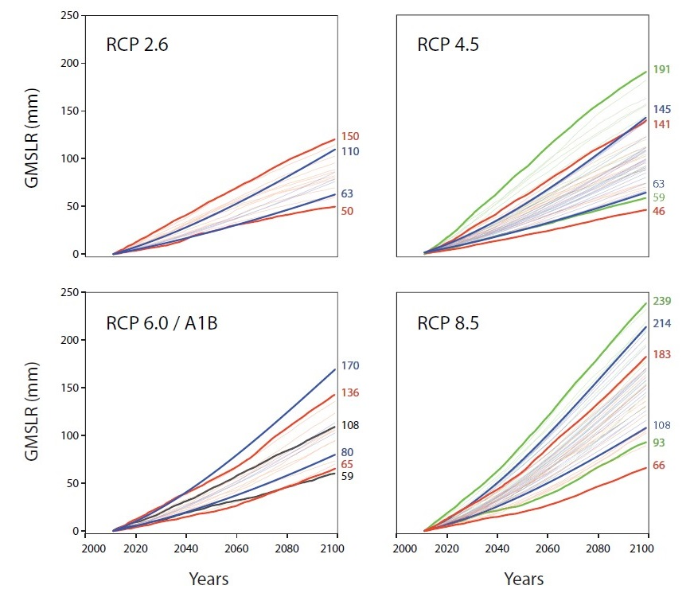
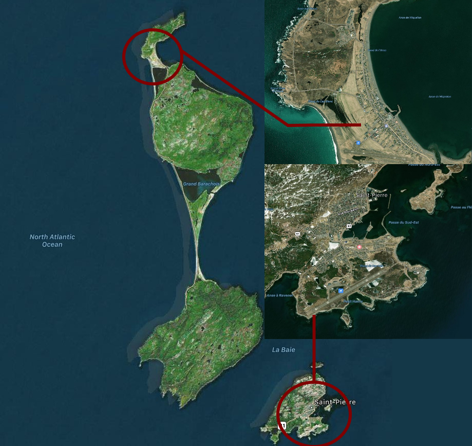
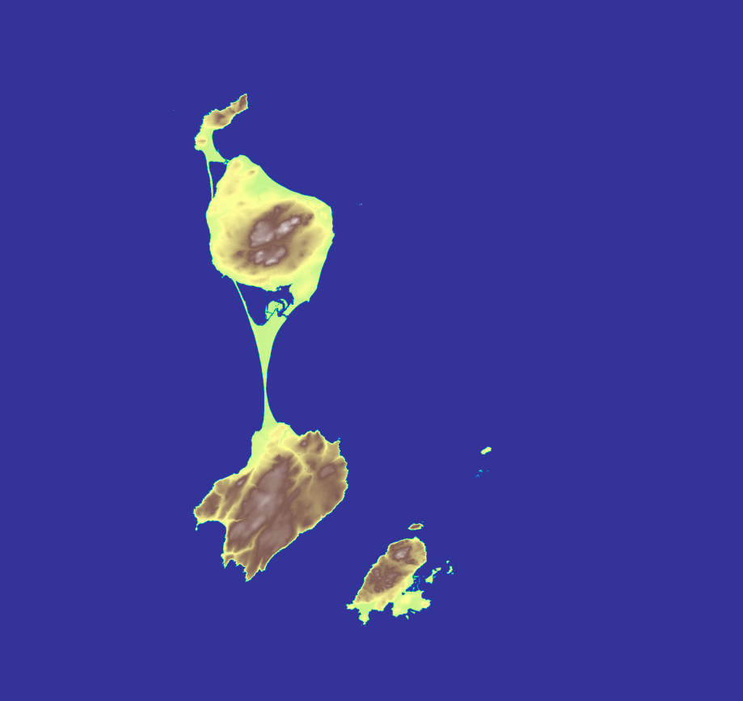
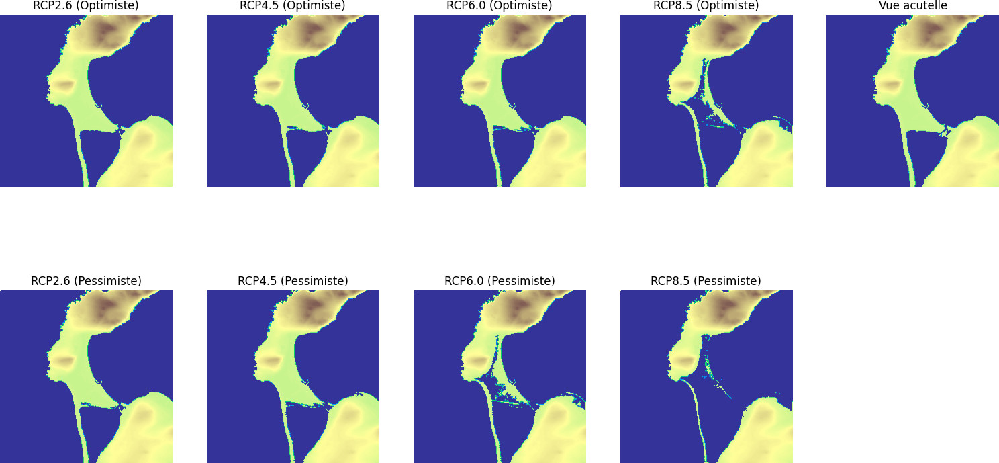
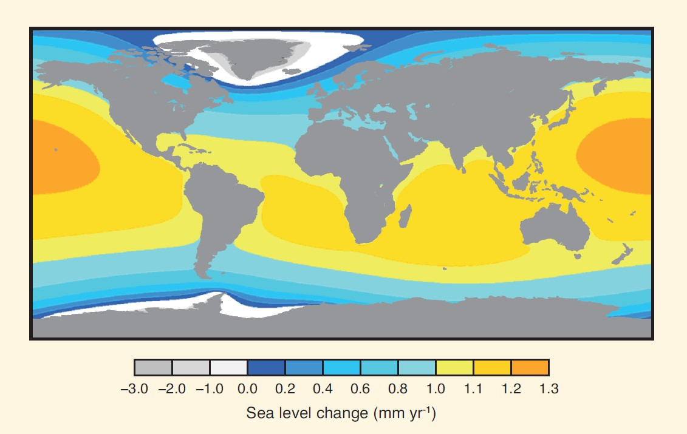

# Sea Level Rise Calculator

Une version française du readme est disponible [ici](https://github.com/seanbogosavac/SeaLevelRiseCalculator/blob/main/README_FR.md).

This project was realised for my Assisted Personnal Initiative Project (TIPE), as part of the French Engineering School Entrance Process in 2021.

## Table of contents
* [How to run](#how-to-run)
* [Creating the equations](#creating-the-equations)
* [Building the map](#building-the-map)
* [Computing the sea rise maps](#computing-the-sea-rise-maps)
* [Limits of the model](#limits-of-the-model)
* [Extras](#extras)
* [Bibliography](#bibliography)

## How to run

The compiled program is available for download [here](https://github.com/seanbogosavac/SeaLevelRiseCalculator/releases).
Once downloaded, you have two ways to run it.

### Interface (Windows only)
Running the executable will prompt you with an interface that you can use to compute the sea level rise maps.


Warning : this interface comes with a few known bugs, but I do not really have the time to fix them for now.

### CLI
You can also run directly the python script by going into the project folder and running
```bash
cd script
python3 main.py
```

Note : running ```python3 main.py -help``` will prompt you with the different commands.

## Creating the equations

The equations used to compute the sea level rise are based on a 2013 IPCC report [[1]](#bibliography). It states that the two biggest component of this rise are the melting of the ice-sheets and glaciers and thermal expansion.

The IPCC provided many graphs in their report included these two :



They show the evolution of the sea level rise due to the thermal expansion and ice melting respectively from the year 2000 to 2100. These models are made alongside 4 scenarios, from the optimistic RCP2.6 (we manage to maintain global warming under 2°C) to the pessimistic RCP8.5 (we keep to increase our CO2 emissions).
I then used polynomial and logarithmical regressions to get functions that I could then use in a program - and extend up to year 2300, which according to the IPCC is where theirs models' reliability ends.

// Functions can be found in [data.py](https://github.com/seanbogosavac/SeaLevelRiseCalculator/tree/main/script/src/data.py)
```python
## Polynomials
# Thermal expansion:
thermExp26 = lambda x: 0.760659*math.log(0.214891*x)
thermExp45 = Polynomial([0.0106288, 0.054236, 0.000706044])
thermExp60 = Polynomial([-0.000592308, 0.0373631, 0.00141606])
thermExp85 = Polynomial([-0.00310769, 0.0308501, 0.00290476])
# Glaciers melting:
glac26max = Polynomial([-2.52809, 0.674157])
glac26min = Polynomial([-0.84270, 0.224719])
glac45max = Polynomial([-2.44382, 0.651685])
glac45min = Polynomial([-0.77500, 0.206742])
glac60max = Polynomial([-2.86517, 0.764045])
glac60min = Polynomial([-1.09551, 0.292135])
glac85max = Polynomial([-3.60674, 0.961798])
glac85min = Polynomial([-1.11236, 0.296629])
```

## Building the map

I chose to use the Saint-Pierre-et-Miquelon Island, a remote french Island in the north atlantic, as the basis for this project. This choice was motivated by the very low altitude at which the inhabitants of this island live, making them dangerously exposed to this phenomenom.

The french government has a lot of data that is publicly accessible, so I retrieved heightmaps from one of those public databases [[2]](#bibliography).

I used the python package matplotlib to transform the ASCII encoded heightmaps into easily readable maps.


*Satelite view of the Island and a focus on the main cities - © Apple Maps*


*Heightmap generated from the datasets*

## Computing the sea rise maps

Running the program will first compute the sea rise in meters by using the aforementioned equations.
Once it has the value, it will apply the sea rise on the map of the island.

Below is an example. It shows the results for all scenarios for the village of Miquelon for the year 2300.


## Limits of the model

This model is heavily simplified and a lot of small climate effects have not been taken into account.

For instance, the sea level change is different depending on the lattitude, an effect that has not been taken into account, despite the island being at a high lattitude (the Saint-Pierre-et-Miquelon island is located near the east canadian coast).


## Extras

* The code has been refactored as a side project, and I then built an interface in C# to use it in a more understandable way. However, this was not present when I first made the code back in 2021. The original code can be found in [this initial commit](https://github.com/seanbogosavac/SeaLevelRiseCalculator/commit/eb9a1bcaed7dfc6c2f2fb35e66b63b13085b3585).

* This program was in fact made out of two scripts.
The second one was supposed to be a script that would help to compute the most cost-effective dyke to build on a given coast. However, it is not working anymore and I cannot figure out how to get it to work again, so it will stay in standby for now.

## Bibliography

[1] IPCC, 2013: Climate Change 2013: The Physical Science Basis. Contribution of Working Group I to the Fifth Assessment Report of the Intergovernmental Panel on Climate Change [Stocker, T.F., D. Qin, G.-K. Plattner, M. Tignor, S.K. Allen, J. Boschung, A. Nauels, Y. Xia, V. Bex and P.M. Midgley (eds.)]. Cambridge University Press, Cambridge, United Kingdom and New York, NY, USA, 1535 pp.
https://www.ipcc.ch/report/ar5/wg1/

[2] IGN (French National Institute for Geographic and Forest Information) – Terrain height databases
https://geoservices.ign.fr/documentation/diffusion/telechargement-donnees-libres.html
