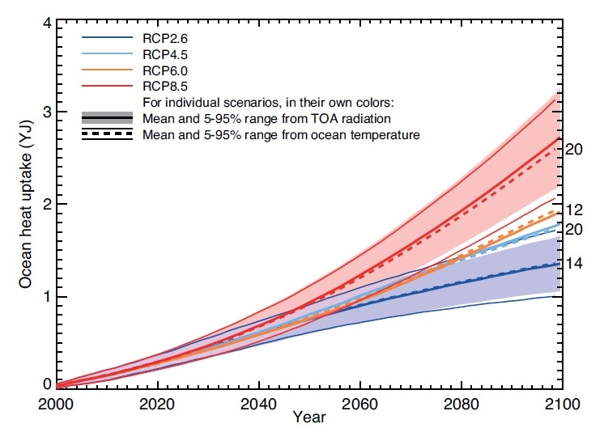
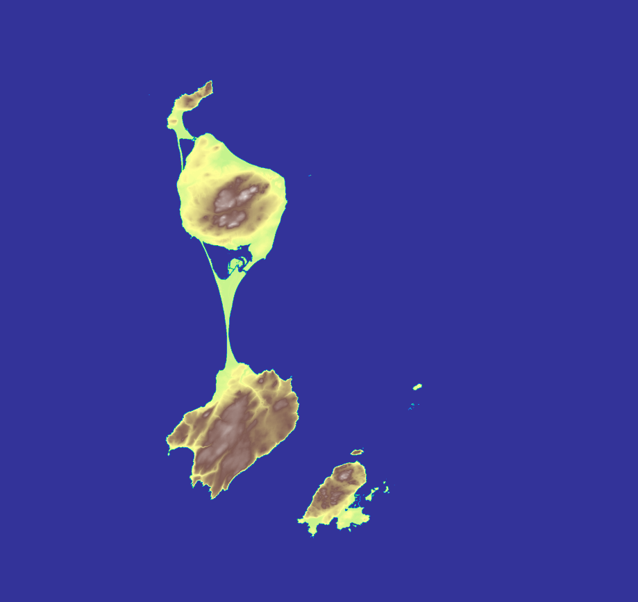

# Simulateur de Montée du Niveau de la Mer

An english version of this readme can be found [here](https://github.com/seanbogosavac/SeaLevelRiseCalculator/blob/main/README.md).

Ce projet a été réalisé dans le cadre des Travaux d'Initiative Personnelle Encadré (TIPE) pour les épreuves d'intégration aux écoles d'ingénieurs en 2021.

## Table des matières
* [Lancer le programme](#lancer-le-programme)
* [Création des équations](#création-des-équations)
* [Construction de la carte](#construction-de-la-carte)
* [Calcul des cartes de montée des eaux](#calcul-des-cartes-de-montée-des-eaux)
* [Limites du modèle](#limites-du-modèle)
* [Extras](#extras)
* [Bibliographie](#bibliographie)

## Lancer le programme

Une version compilée du programme est disponible [ici](https://github.com/seanbogosavac/SeaLevelRiseCalculator/releases).
Une fois téléchargée, il y a deux moyens de l'éxecuter.

### Interface (Windows uniquement)
Lancer l'éxecutable vous permettra d'accéder à une interface que vous pouvez utiliser afin de calculer les cartes de montée des eaux.


Attention : cette interface a plusieurs bugs connus, mais je n'ai pas de temps à consacrer à leurs correction.

### Interface par ligne de commande
Vous pouvez également lancer directement les scripts python en utilisant les commandes suivantes :
```bash
cd script
python3 main.py
```

Note : Lancez ```python3 main.py -help``` pour obtenir des informations concernants les arguments du script.

## Création des équations

Les équations utilisées pour calcules la montée du niveau de l'eau sont basées sur le rapport du GIEC de 2013 [[1]](#bibliography). Ce dernier indique que les deux principales causes de la montée de l'eau sont la fonte des glaciers, et la dilatation thermique.

Le GIEC a fourni beaucoup de graphiques dans son rapport, dont les deux suivants :



Ces graphiques montrent l'évolution du niveau de l'eau attribuable respectivement à la dilatation thermique et à la fonte des glaces, entre 2000 et 2100. Ces modélisations suivent 4 scénarii, du plus optimiste RCP2.6 (le réchauffement reste sous la barre des 2°C) au plus pessimiste RCP8.5 (les émissions de CO2 continuent d'augmenter).
L'utilisation de régressions polynomiales et logarithmiques m'a permis d'obtenir des fonctions que j'ai pu ensuite utiliser dans mon programme - et ainsi prolonger les courbes jusqu'à l'année 2300, après laquelle le GIEC considère que ses modèles ne sont plus fiables.

// Les fonctions peuvent être trouvées dans [data.py](https://github.com/seanbogosavac/SeaLevelRiseCalculator/tree/main/script/src/data.py)
```python
## Polynomials
# Thermal expansion:
thermExp26 = lambda x: 0.760659*math.log(0.214891*x)
thermExp45 = Polynomial([0.0106288, 0.054236, 0.000706044])
thermExp60 = Polynomial([-0.000592308, 0.0373631, 0.00141606])
thermExp85 = Polynomial([-0.00310769, 0.0308501, 0.00290476])
# Glaciers melting:
glac26max = Polynomial([-2.52809, 0.674157])
glac26min = Polynomial([-0.84270, 0.224719])
glac45max = Polynomial([-2.44382, 0.651685])
glac45min = Polynomial([-0.77500, 0.206742])
glac60max = Polynomial([-2.86517, 0.764045])
glac60min = Polynomial([-1.09551, 0.292135])
glac85max = Polynomial([-3.60674, 0.961798])
glac85min = Polynomial([-1.11236, 0.296629])
```

## Construction de la carte

J'ai choisi d'utiliser comme base pour cette étude l'île de Saint-Pierre-et-Miquelon, une île française d'Amérique du Nord. Un choix motivé par la faible altitude à laquelle les habitants de l'île vivent, ce qui les expose d'autant plus à ce phénomène climatique.

Les agences gouvernementales françaises mettent beaucoup de données en accès libre sur internet [[2]](#bibliography), j'ai pu donc récuperer des bases de données d'altitude pour construire des matrices altimétriques.

L'utilisation du paquet python matplotlib m'a permis de transformer ces matrices altimétriques du format ASCII à une image lisible.


*Vue sattelite de l'île avec un focus sur les villes principales - © Apple Maps*


*Carte alitmétrique générée avec les sets de données*

## Calcul des cartes de montée des eaux

Lancer le programme va d'abord calculer la montée du niveau de la mer en mètre, à partir des équations susmentionées.
Une fois cette valeur calculée, il l'applique aux cartes de l'île.

Un exemple est disponible ci-dessous, montrant le résultats pour le village de Miquelon, pour tous les scénarii, à l'an 2300.


## Limites du modèle

Ce modèle reste très simplifié, et fait fi de nombreux petites subtilités du climat.

Par exemple, le changement du niveau de la mer diffère selon la lattitude. Un effet non pris en compte, malgré la haute lattitude de l'île (l'île de Saint-Pierre-et-Miquelon étant située près de la côte est canadienne).


## Extras

* En guise de projet personnel, j'ai réécrit l'intégralité du code et ai ajouté un interface développée en C#, pour rendre l'utilisation du programme plus claire. Cependant, ce n'était pas présent lorsque j'ai créé ce programme en 2021. Le code original est trouvable dans [ce commit](https://github.com/seanbogosavac/SeaLevelRiseCalculator/commit/eb9a1bcaed7dfc6c2f2fb35e66b63b13085b3585).

* Ce programme était à l'origine composé de deux scripts. Le second était censé être un script qui aidait au calcul d'une digue avantageuse entre terme de coût-résultat sur une côte donnée. Cependant, cette partie du programme ne fonctionne plus, sans que je ne sache pourquoi, cette partie reste donc sans suite pour l'instant.

## Bibliographie

[1] IPCC, 2013: Climate Change 2013: The Physical Science Basis. Contribution of Working Group I to the Fifth Assessment Report of the Intergovernmental Panel on Climate Change [Stocker, T.F., D. Qin, G.-K. Plattner, M. Tignor, S.K. Allen, J. Boschung, A. Nauels, Y. Xia, V. Bex and P.M. Midgley (eds.)]. Cambridge University Press, Cambridge, United Kingdom and New York, NY, USA, 1535 pp.
https://www.ipcc.ch/report/ar5/wg1/

[2] Géoservices IGN – Bases de données altimétriques
https://geoservices.ign.fr/documentation/diffusion/telechargement-donnees-libres.html#rge-alti-5-m
